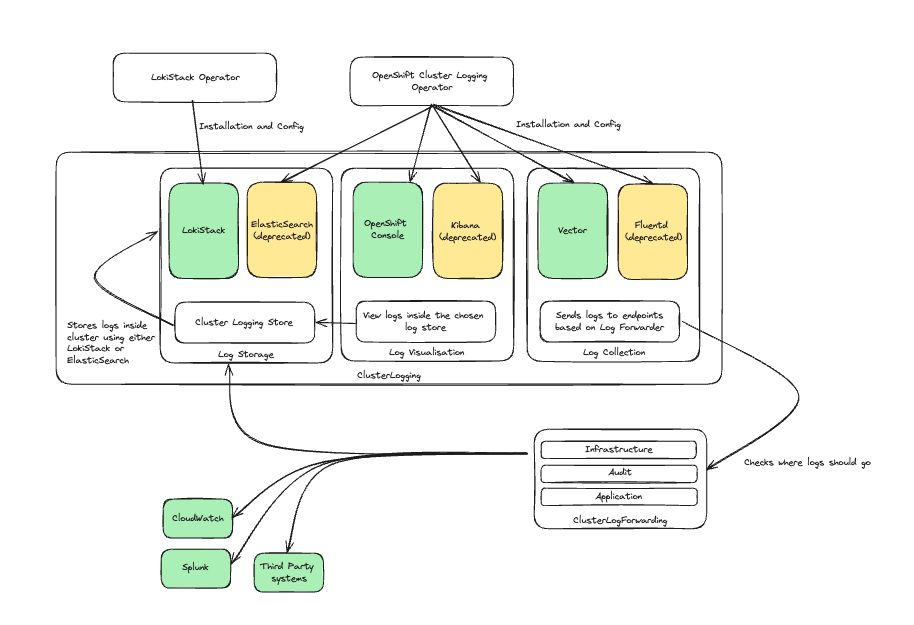
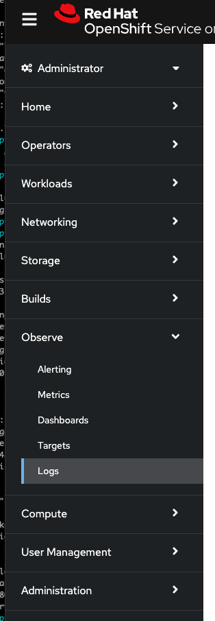
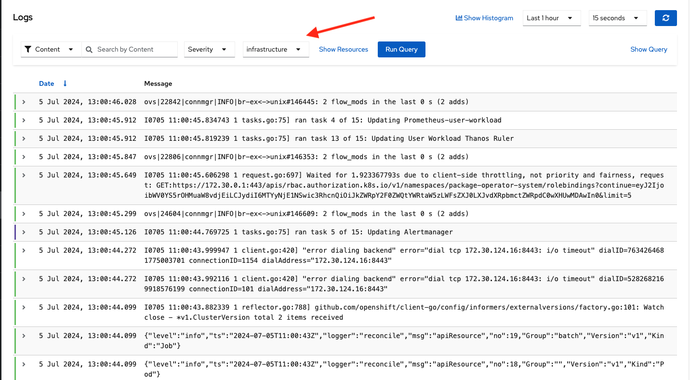
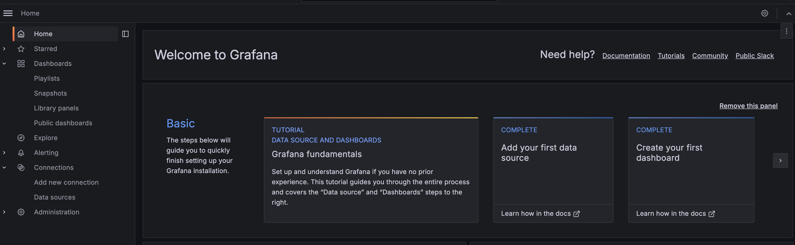
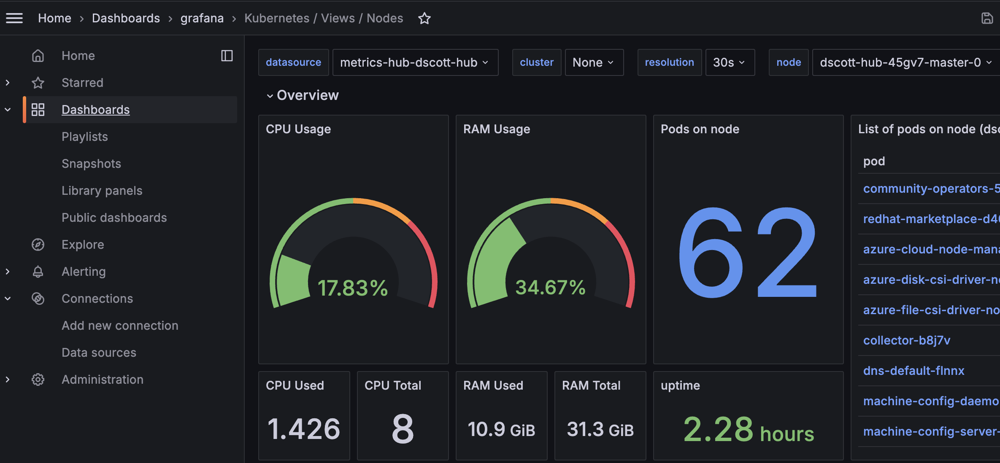
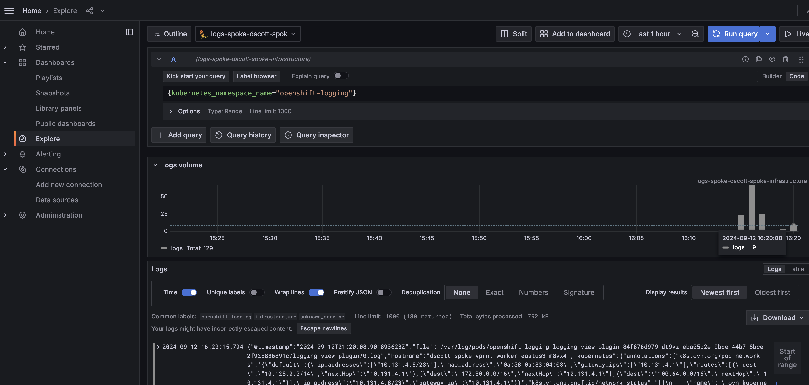

A guide to shipping logs and metrics on OpenShift using the LokiStack setup. The default logging system 
with OpenShift swapped from ElasticSearch/FluentD/Kibana to a system based on LokiStack/Vector/OCP Console. LokiStack 
requires an object store in order to function, and this guide is designed to walk the user through the steps required 
to set this up.

This guide is specific to Azure Red Hat OpenShift.  For other platforms see:

  - [ROSA](https://cloud.redhat.com/experts/o11y/openshift-logging-lokistack/)

Beyond the ability to simply visualize logs and metrics for a single cluster, optionally, this guide 
will show you how to federate metrics and logs from multiple clusters into a 
centralized Hub cluster.


## Overview of the components of OpenShift Cluster Logging




## Prerequisites

1. OpenShift CLI (oc)
1. An ARO cluster (see our [quickstart guide](https://cloud.redhat.com/experts/quickstart-aro/))
1. Rights to install operators on the cluster
1. Access to create Blob Storage Container in Azure


## Setting up your environment for ARO

1. Create environment variables to use later in this process by running the following commands:

    ```bash
    export AZR_CLUSTER="dscott-spoke"
    export AZR_LOCATION="eastus"
    export AZR_STORAGE_ACCOUNT_NAME="storage$(echo $AZR_CLUSTER | tr -d '\-_')"
    export AZR_RESOURCE_GROUP="dscott-spoke-rg"
    ```

1. Create a storage account for the LokiStack Operator to consume:

    ```bash
    az storage account create \
      --name "${AZR_STORAGE_ACCOUNT_NAME}" \
      --resource-group "${AZR_RESOURCE_GROUP}" \
      --location "${AZR_LOCATION}" \
      --sku Standard_LRS
    ```

1. Store the storage account key for the storage account in the environment:
   
    ```bash
    AZR_STORAGE_KEY=$(az storage account keys list --resource-group "${AZR_RESOURCE_GROUP}" -n "${AZR_STORAGE_ACCOUNT_NAME}" --query "[0].value" -o tsv)
    ```

2. Create a storage bucket for logs (metrics will be consumed from Prometheus in the cluster):

    ```bash
    az storage container create \
      --name "aro-logs" \
      --account-name "${AZR_STORAGE_ACCOUNT_NAME}" \
      --account-key "${AZR_STORAGE_KEY}"
    ```


## Install the OpenShift Cluster Logging Operator

1. Create a namespace for the OpenShift Red Hat Operators:

    ```bash
    oc apply -f - <<EOF
    apiVersion: v1
    kind: Namespace
    metadata:
      name: openshift-operators-redhat
      annotations:
        openshift.io/node-selector: ""
      labels:
        openshift.io/cluster-monitoring: "true"
    EOF
    ```

1. Create a namespace for the OpenShift Logging Operator:

    ```bash
    oc apply -f - <<EOF
    apiVersion: v1
    kind: Namespace
    metadata:
      name: openshift-logging
      annotations:
        openshift.io/node-selector: ""
      labels:
        openshift.io/cluster-monitoring: "true"
    EOF
    ```


1. Install the Loki Operator by creating the following objects:

    ```bash
    oc apply -f - <<EOF
    apiVersion: operators.coreos.com/v1
    kind: OperatorGroup
    metadata:
      name: loki
      namespace: openshift-operators-redhat
    spec:
      upgradeStrategy: Default
    ---
    apiVersion: operators.coreos.com/v1alpha1
    kind: Subscription
    metadata:
      name: loki-operator
      namespace: openshift-operators-redhat
    spec:
      channel: "stable-5.9"
      name: loki-operator
      source: redhat-operators
      sourceNamespace: openshift-marketplace
      startingCSV: loki-operator.v5.9.3
    EOF
    ```

1. Verify Operator Installation, the `PHASE` should be `Succeeded`:

    ```bash
    oc get csv -n openshift-operators-redhat
    ```

    Example Output:

    ```
    NAME                     DISPLAY                     VERSION   REPLACES                 PHASE
    loki-operator.v5.9.3     Loki Operator               5.9.3     loki-operator.v5.9.2     Succeeded
    ```


## Configure the LokiStack Installation

> **NOTE:** this configuration uses a simple configuration and installation.  If you need something more specific 
> to your use case, please see https://grafana.com/docs/loki/latest/configure/storage/#azure-deployment-azure-blob-storage-single-store 
> for all configuration options.

1. Create a secret for the LokiStack Operator to consume by running the following command:

    ```bash
    oc -n openshift-logging create secret generic logging-loki-azure \
      --from-literal=account_name="${AZR_STORAGE_ACCOUNT_NAME}" \
      --from-literal=account_key="${AZR_STORAGE_KEY}" \
      --from-literal=container="aro-logs" \
      --from-literal=environment="AzureGlobal" \
      --from-literal=use_managed_identity=false
    ```

1. Create a LokiStack installation by creating the following object:

    ```bash
    oc apply -f - <<EOF
    apiVersion: loki.grafana.com/v1
    kind: LokiStack
    metadata:
      name: logging-loki 
      namespace: openshift-logging
    spec:
      size: 1x.extra-small 
      storage:
        schemas:
          - effectiveDate: '2023-10-15'
            version: v13
        secret:
          name: logging-loki-azure 
          type: azure 
      storageClassName: managed-csi
      tenants:
        mode: openshift-logging
    EOF
    ```

1. Confirm your LokiStack is running successfully by running the following command:

    ```bash
    oc get pods -n openshift-logging
    ```

    > **NOTE:** If you see pods in `Pending` state, confirm that you have sufficient resources in the cluster to run a 
    > LokiStack. An overview of LokiStack sizing can be found here: 
    > https://docs.openshift.com/rosa/observability/logging/log_storage/installing-log-storage.html#loki-deployment-sizing_installing-log-storage

1. Install the Cluster Logging Operator:

    ```bash
    oc apply -f - <<EOF
    apiVersion: operators.coreos.com/v1
    kind: OperatorGroup
    metadata:
      name: cluster-logging
      namespace: openshift-logging
    spec:
      targetNamespaces:
      - openshift-logging
    ---
    apiVersion: operators.coreos.com/v1alpha1
    kind: Subscription
    metadata:
      name: cluster-logging
      namespace: openshift-logging
    spec:
      channel: "stable"
      name: cluster-logging
      source: redhat-operators
      sourceNamespace: openshift-marketplace
    EOF
    ```

1. Verify the Operator installation, the `PHASE` should be `Succeeded`:

    ```bash
    oc get csv -n openshift-logging
    ```

    Example Output:

    ```
    NAME                     DISPLAY                     VERSION   REPLACES                 PHASE
    cluster-logging.v5.9.3   Red Hat OpenShift Logging   5.9.3     cluster-logging.v5.9.2   Succeeded
    loki-operator.v5.9.3     Loki Operator               5.9.3     loki-operator.v5.9.2     Succeeded
    ```

1. Create an OpenShift Logging instance, specifying the `logStore`.  This configures the ClusterLogging Operator to use 
the existing LokiStack we have created in the cluster as it's LogStorage:

    ```bash
    oc apply -f - <<EOF
    apiVersion: logging.openshift.io/v1
    kind: ClusterLogging
    metadata:
      name: instance
      namespace: openshift-logging
    spec:
      managementState: "Managed"
      logStore:
        type: "lokistack"
        lokistack:
          name: logging-loki
      collection:
        type: "vector"
        vector: {}
      visualization:
        type: "ocp-console"
        ocpConsole: {}
    EOF
    ```

1. Confirm you can see collector pods starting up using the following command. There should be one per node.

    ```bash
    oc get pods -n openshift-logging | grep collector
    ```

    Example output:

    ```
    collector-49qnt                                1/1     Running   0          11m
    collector-gvd5x                                1/1     Running   0          11m
    collector-qfqxs                                1/1     Running   0          11m
    collector-r7scm                                1/1     Running   0          11m
    collector-zlzpf                                1/1     Running   0          11m
    ```

1. Ensure the Console Plugin is enabled by running the following command:

    ```bash
    oc get consoles.operator.openshift.io cluster -o yaml | grep logging-view-plugin  \
    || oc patch consoles.operator.openshift.io cluster  --type=merge \
    --patch '{ "spec": { "plugins": ["logging-view-plugin"]}}'
    ```

    Example output:

    ```bash
    clusterlogging.logging.openshift.io/instance patched
    ```

1. Here, we have added the console-view-plugin to allow us to view logs in the OpenShift console. You can check that 
the pod has been created using the following command:

    ```bash
    oc get pods -n openshift-logging | grep logging-view-plugin
    ```

    Example output:

    ```bash
    logging-view-plugin-bd5978d6d-9sc5v            1/1     Running   0          8m41s
    ```  

1. Confirm you can see the Logging section of the console under the Observe tab:

  

At this point OpenShift logging is installed and configured and is ready to receive logs.


## Install the ClusterLogForwarder Custom Resource

Separately from the ClusterLogging storage system, the OpenShift Cluster Logging Operator provides the 
ClusterLogForwarder which allows you to describe which log types are sent where. We will now configure this to collect 
all logs from our cluster and forward them to our log store

1. Create a basic ClusterLogForwarder using the following command:

    ```bash
    oc apply -f - <<EOF
    apiVersion: "logging.openshift.io/v1"
    kind: ClusterLogForwarder
    metadata:
      name: "instance"
      namespace: "openshift-logging"
    spec:
      pipelines:
      - name: all-logs
        inputRefs:
          - infrastructure
          - applicastion
          - audit
        outputRefs:
          - default
    EOF
    ```

This example selects all logs (infrastructure, application, audit) and forwards them to "default", which is a 
reference to our LokiStack Logging Store. If we go to the Console and browse to Observer -> Logs, then change 
the dropdown from "application" to "infrastructure" we can now see logs:



For more examples or configuration options please see the documentation here: 
https://docs.openshift.com/rosa/observability/logging/log_collection_forwarding/configuring-log-forwarding.html


## Observability Federation with Grafana

At this point in the walkthrough, you are able to see logs from the **current cluster** via the **Observe > Logs** tab 
and, by default, look at metrics via the **Observe > Metrics** tab.  However, what if you wanted a single place to 
view your observability data across a fleet of clusters?

A common pattern is to implement a "Hub" or "Shared Services" cluster to aggregate and centralize various aspects 
of cluster management.  This section is an example of aggregating log and metric data from "Spoke" to "Hub" and
view the data using Grafana.

At this point in the walkthrough, we can think of the steps above as representing the "Hub" cluster.


### Hub Cluster Configuration

These steps will show you how to configure a Grafana instance for observability visualization, as well as 
connect the initial hub cluster to that instance so that it becomes part of the overall federation.

Before beginning, we will set up the environment:

```bash
export CLUSTER_TYPE="hub"
export LOKI_URL="https://logging-loki-gateway-http.openshift-logging.svc.cluster.local:8080"
export PROMETHEUS_URL="https://thanos-querier.openshift-monitoring.svc.cluster.local:9091"
```

#### Grafana Installation and Configuration

1. In the hub cluster, install the Grafana operator:

    ```bash
    oc apply -f - <<EOF
    apiVersion: operators.coreos.com/v1alpha1
    kind: Subscription
    metadata:
      labels:
        operators.coreos.com/grafana-operator.openshift-operators: ""
      name: grafana-operator
      namespace: openshift-operators
    spec:
      channel: v5
      installPlanApproval: Automatic
      name: grafana-operator
      source: community-operators
      sourceNamespace: openshift-marketplace
      startingCSV: grafana-operator.v5.12.0
    EOF
    ```

1. Verify the Operator installation, the `PHASE` should be `Succeeded`:

    ```bash
    oc get csv -n openshift-operators
    ```

    Example Output:

    ```
    NAME                       DISPLAY            VERSION   REPLACES                   PHASE
    grafana-operator.v5.13.0   Grafana Operator   5.13.0    grafana-operator.v5.12.0   Succeeded
    ```

1. Create a new Grafana instance:

    ```bash
    oc apply -f - <<EOF
    ---
    apiVersion: v1
    kind: Namespace
    metadata:
      name: grafana
    ---
    apiVersion: grafana.integreatly.org/v1beta1
    kind: Grafana
    metadata:
      name: grafana
      namespace: grafana
      labels:
        app.kubernetes.io: grafana-hub
    spec:
      config:
        auth:
          disable_login_form: "false"
          disable_signout_menu: "true"
        log:
          level: warn
          mode: console
      persistentVolumeClaim:
        spec:
          accessModes:
            - ReadWriteOnce
          storageClassName: managed-csi
          resources:
            requests:
              storage: 10Gi
      deployment:
        metadata:
          labels:
            app.kubernetes.io: grafana-hub
        spec:
          template:
            metadata:
              labels:
                app.kubernetes.io: grafana-hub
            spec:
              volumes:
              - name: grafana-data
                persistentVolumeClaim:
                  claimName: grafana-pvc
      route:  
        spec: {}
    EOF
    ```

1. Create the standard Kubernetes dashboards for metrics observability.  There are many more dashboards to
use and create but this is a good starting point:

    ```bash
    for DASHBOARD in k8s-addons-prometheus k8s-addons-trivy-operator k8s-system-api-server k8s-system-coredns k8s-views-global k8s-views-namespaces k8s-views-nodes k8s-views-pods; do
      DASHBOARD_JSON="$(curl -k -s https://raw.githubusercontent.com/dotdc/grafana-dashboards-kubernetes/master/dashboards/$DASHBOARD.json | jq -c .)"

      oc apply -f - <<EOF
      apiVersion: grafana.integreatly.org/v1beta1
      kind: GrafanaDashboard
      metadata:
        name: $DASHBOARD
        namespace: grafana
      spec:
        instanceSelector:
          app.kubernetes.io: grafana-hub
        json: |
          $DASHBOARD_JSON
    EOF
    done
    ```

1. Retrieve the username and password that was created and login to the Grafana instance:

    ```bash
    export ADMIN_USERNAME=$(oc get secrets -n grafana grafana-admin-credentials -o json | jq -r '.data.GF_SECURITY_ADMIN_USER' | base64 -d)
    export ADMIN_PASSWORD=$(oc get secrets -n grafana grafana-admin-credentials -o json | jq -r '.data.GF_SECURITY_ADMIN_PASSWORD' | base64 -d)
    export GRAFANA_URL="https://$(oc get route -n grafana grafana-route -o json | jq -r '.status.ingress[0].host')"

    echo $ADMIN_USERNAME
    echo $ADMIN_PASSWORD
    echo $GRAFANA_URL
    ```

1. Navigate to the `GRAFANA_URL` above and ensure you can login as the admin user:




#### User Workload Monitoring

1. In cluster, ensure that [user workload monitoring](https://docs.openshift.com/container-platform/4.16/observability/monitoring/enabling-monitoring-for-user-defined-projects.html) (if desired) is enabled to 
allow non-OpenShift workloads to be monitored:

    ```bash
    oc patch configmap cluster-monitoring-config -n openshift-monitoring --type=json -p='[{"op": "add", "path": "/data/config.yaml", "value": "enableUserWorkload: true\n"}]'
    ```


#### Metrics Federation

1. Retrieve the `grafana-sa` service account token:

    ```bash
    export BEARER_TOKEN=$(oc -n grafana get secrets -o jsonpath='{.items[?(@.metadata.annotations.kubernetes\.io/service-account\.name=="grafana-sa")].data.token}' | base64 -d)
    ```

1. Allow the Grafana service account to view metrics:

    ```bash
    oc apply -f - <<EOF
    apiVersion: authorization.openshift.io/v1
    kind: ClusterRoleBinding
    metadata:
      name: grafana-view
    roleRef:
      name: cluster-monitoring-view
    subjects:
      - kind: ServiceAccount
        name: grafana-sa
        namespace: grafana
    EOF
    ```

1. In the hub cluster, create a `GrafanaDataSource` object to allow the ability to federate the metrics
data for this cluster:

    > **NOTE:** be aware that the `GrafanaDataSource` object MUST BE created in your Hub cluster, as
    > this is the cluster that has Grafana installed and has the set of CRDs available to deploy.

    ```bash
    oc apply -f - <<EOF
    apiVersion: grafana.integreatly.org/v1beta1
    kind: GrafanaDatasource
    metadata:
      name: metrics-${CLUSTER_TYPE}-${AZR_CLUSTER}
      namespace: grafana
    spec:
      instanceSelector:
        app.kubernetes.io: grafana-hub
      datasource:
        name: metrics-${CLUSTER_TYPE}-${AZR_CLUSTER}
        type: prometheus
        url: '${PROMETHEUS_URL}'
        access: proxy
        editable: true
        isDefault: true
        jsonData:
          httpHeaderName1: Authorization
          timeInterval: 5s
          tlsSkipVerify: true
        secureJsonData:
          httpHeaderValue1: 'Bearer ${BEARER_TOKEN}'
    EOF
    ```

In Grafana, you can view the metrics by navigating to **Dashboards** and selecting your dashboard 
(e.g. **grafana > Kubernetes / Views / Nodes**) and selecting your data source from the drop down menu:




#### Logging Federation

1. Allow the Grafana service account to view logs:

    ```bash
    oc apply -f - <<EOF
    apiVersion: authorization.openshift.io/v1
    kind: ClusterRoleBinding
    metadata:
      name: loki-view-application
    roleRef:
      name: cluster-logging-application-view
    subjects:
      - kind: ServiceAccount
        name: grafana-sa
        namespace: grafana
    ---
    apiVersion: authorization.openshift.io/v1
    kind: ClusterRoleBinding
    metadata:
      name: loki-view-infrastructure
    roleRef:
      name: cluster-logging-infrastructure-view
    subjects:
      - kind: ServiceAccount
        name: grafana-sa
        namespace: grafana
    ---
    apiVersion: authorization.openshift.io/v1
    kind: ClusterRoleBinding
    metadata:
      name: loki-view-audit
    roleRef:
      name: cluster-logging-audit-view
    subjects:
      - kind: ServiceAccount
        name: grafana-sa
        namespace: grafana
    EOF
    ```

1. In the hub cluster, create the `GrafanaDataSource` objects to allow the ability to federate the Loki log
data for this cluster for each logging category (e.g. infrastructure, audit, application):

    > **NOTE:** be aware that the `GrafanaDataSource` objects MUST BE created in your Hub cluster, as
    > this is the cluster that has Grafana installed and has the set of CRDs available to deploy.

    ```bash
    oc apply -f - <<EOF
    apiVersion: grafana.integreatly.org/v1beta1
    kind: GrafanaDatasource
    metadata:
      name: logs-${CLUSTER_TYPE}-${AZR_CLUSTER}-infrastructure
      namespace: grafana
    spec:
      instanceSelector:
        app.kubernetes.io: grafana-hub
      datasource:
        name: logs-${CLUSTER_TYPE}-${AZR_CLUSTER}-infrastructure
        type: loki
        editable: true
        access: proxy
        url: ${LOKI_URL}/api/logs/v1/infrastructure/
        jsonData:
          tlsSkipVerify: true
          httpHeaderName1: Authorization
          timeInterval: 5s
        secureJsonData:
          httpHeaderValue1: 'Bearer ${BEARER_TOKEN}'
    ---
    apiVersion: grafana.integreatly.org/v1beta1
    kind: GrafanaDatasource
    metadata:
      name: logs-${CLUSTER_TYPE}-${AZR_CLUSTER}-application
      namespace: grafana
    spec:
      instanceSelector:
        app.kubernetes.io: grafana-hub
      datasource:
        name: logs-${CLUSTER_TYPE}-${AZR_CLUSTER}-application
        type: loki
        editable: true
        access: proxy
        url: ${LOKI_URL}/api/logs/v1/application/
        jsonData:
          tlsSkipVerify: true
          httpHeaderName1: Authorization
          timeInterval: 5s
        secureJsonData:
          httpHeaderValue1: 'Bearer ${BEARER_TOKEN}'
    ---
    apiVersion: grafana.integreatly.org/v1beta1
    kind: GrafanaDatasource
    metadata:
      name: logs-${CLUSTER_TYPE}-${AZR_CLUSTER}-audit
      namespace: grafana
    spec:
      instanceSelector:
        app.kubernetes.io: grafana-hub
      datasource:
        name: logs-${CLUSTER_TYPE}-${AZR_CLUSTER}-audit
        type: loki
        editable: true
        access: proxy
        url: ${LOKI_URL}/api/logs/v1/audit/
        jsonData:
          tlsSkipVerify: true
          httpHeaderName1: Authorization
          timeInterval: 5s
        secureJsonData:
          httpHeaderValue1: 'Bearer ${BEARER_TOKEN}'
    EOF
    ```

In Grafana, you can view the logs by navigating to **Explore** and selecting your data source from the 
drop down menu in the top.  You can use `{kubernetes_namespace_name="openshift-logging"}` in the 
"infrastructure" data source to view some sample logs:



Please note that there are many dashboards to choose from if you want specific dashboards 
for viewing logging in Loki (see https://grafana.com/grafana/dashboards/18042-logging-dashboard-via-loki-v2/ 
for one example however there are many more to choose from).


### Spoke Cluster Configuration

Most of the configuration steps for the spoke cluster remain the same as the hub cluster.  However, do be 
aware that when you apply `Grafana*` custom resource definitions, you will need to do this in the Hub cluster 
as the Hub cluster is where Grafana is running.

Before beginning, we will set up the environment:

```bash
export CLUSTER_TYPE="spoke"
export PROMETHEUS_URL="https://$(oc get route -n openshift-monitoring thanos-querier -o json | jq -r '.status.ingress[0].host')"
```

To configure the spoke cluster:

1. Create the Grafana service account which holds the token credentials to allow Grafana from the Hub cluster 
to access metrics and logs from Loki and Prometheus in the spoke cluster:

    ```bash
    oc apply -f - <<EOF
    ---
    apiVersion: v1
    kind: Namespace
    metadata:
      name: grafana
    ---
    apiVersion: v1
    kind: ServiceAccount
    metadata:
      name: grafana-sa
      namespace: grafana
    EOF
    ```

1. [Configure the storage for Loki](#setting-up-your-environment-for-aro)

    > **NOTE:** alternative to having a Loki installation per cluster, you may also forward to the Loki 
    > installation in the Hub cluster.  See 
    > https://docs.openshift.com/container-platform/4.15/observability/logging/log_collection_forwarding/configuring-log-forwarding.html#cluster-logging-collector-log-forward-loki_configuring-log-forwarding 
    > for details on this configuration.  Also understand that this walkthrough assumes one Loki 
    > installation per cluster.

1. [Install the necessary operators](#install-the-openshift-cluster-logging-operator)
1. [Install and configure Loki](#configure-the-lokistack-installation)
1. [Forward logs to Loki](#install-the-clusterlogforwarder-custom-resource)

1. Set the `LOKI_URL` environment variable:

    ```bash
    export LOKI_URL="https://$(oc get route -n openshift-logging logging-loki -o json | jq -r '.status.ingress[0].host')"
    ```

1. [Configure user workload monitoring](#user-workload-monitoring)
1. [Configure metrics federation](#metrics-federation)
1. [Configure log federation](#logging-federation)
